# 🪄 Architecture Design - CRM (HubSpot and MYD)

> ℹ️ **Purpose:** Define and evaluate an architecture design.

> _Extraction notes: All diagrams from the source PDF have been redrawn in Mermaid. Where the source image was cropped or partly illegible this is flagged inline. UI screenshots are described as field lists. "Connect your OneDrive account" link artefacts have been removed._

---

## Candidate Architecture Design

| Document owner | Reviewers | Decision date |
|---|---|---|
| Richard Wharram | Alex Hemingway (Development Team) - Product Manager (Customer Systems) Haris Tanwir - Integration Lead James Hoodless - Data Manager Mustafa Iqbal - Head of Data Robert Hyman - Senior Data Engineer Paddy Broderick - Enterprise Architect Adrian Wells - Clinical Systems Architect Paresh Patel - Project Manager Lorna O'Neill - Business Architecture Manager Claire Wych - Business Change Lead Iain Clarke (Unlicensed) - Infrastructure Manager James Burke - Service and Supplier Manager | Mar 10, 2026 |
| **Status** | `DRAFT` | Version 0.1 |

---

## Table Of Contents

- [Candidate Architecture Design](#candidate-architecture-design)
- [Background](#background)
  - [Business Case Summary](#business-case-summary)
  - [Product Selection](#product-selection)
  - [Other Context](#other-context)
    - Systems Landscape - R4
    - Systems Landscape - Orthobridge
    - Systems Landscape - Dentally
    - Systems Landscape - mydentist Website
    - Systems Landscape - PatientComms (V3)
    - Systems Landscape - LMT (V2)
    - Systems Landscape - Salesforce (Existing Lead Gen CRM System)
    - Systems Landscape - Call Centre Telephony
- [Scope](#scope)
  - In Scope
  - Out Of Scope
  - Assumptions and Constraints
  - Caveats for Current Design
- [Functional Requirements](#functional-requirements)
- [Non-functional Requirements (NFRs)](#non-functional-requirements-nfrs)
- [Current State Overview](#current-state-overview)
- [Architecture Design](#architecture-design)
  - System and Business Context view
  - Integrations view
  - System Changes
  - Platform Configuration
  - Security view
  - Data view
  - Infrastructure View
  - Support & Maintenance view
- [Decisions Pending or Made](#decisions-pending-or-made)
- [Assumptions, Risks, Issues, Dependencies](#assumptions-risks-issues-dependencies)
- [Implementation Outline](#implementation-outline)
- [References and Related Artefacts](#references-and-related-artefacts)
- [TDA Feedback Tracker](#tda-feedback-tracker)

---

## Background

### Business Case Summary

See the business case: `CRM - Business Case - 20251113 - v0.7 (2).docx`

Excerpt:

> "Mydentist currently does not have a modern customer relationship management (CRM) platform. This creates a poor customer experience with prospective and existing customers not benefiting from joined up automated marketing and communications campaigns, or greater targeting and personalisation. It also means there are significant missed opportunities to improve the attraction of new leads, increase conversion to treatment, and retain a higher proportion of customers. This results in lower conversion of higher value treatments, suppressing productivity and EBITDA growth, and lower efficiency with teams having to use repetitive manual entry processes to manage leads. In addition, as mydentist expands, increasing opening hours and adding new surgeries, CRM will be an essential tool to support increased diary utilisation.
>
> Extensive research has been undertaken through Cognizant's market review and our interactions with multiple CRM clients, to demonstrate that there is a huge growth opportunity in better managing patient and customer journeys, using carefully timed and curated communications and constantly listening and responding to interactions across all touchpoints. Our current enquiry to PMS (Patient Management System) conversion rate is 7.4% for new customers and 21.9% for existing customers. This shows that there is a substantial revenue opportunity to increase the conversions from enquiry through to treatments. Whilst mydentist has a valuable customer database asset of approximately 4m active customers, there is an opportunity to use CRM to increase revenue per patient and grow this asset value. There is also scope to increase the active patient retention rate from 73.7% to 77% over the next three years and thereby improve patient yield and reduce new customer acquisition costs."

### Product Selection

The RFP process is summarised in the deck linked below:

[Customer Tech CRM Project Board Pack - PP update 20250730.pptx](https://idhgroup.sharepoint.com/:p:/r/sites/PhoenixProgrammeDoc/_layouts/15/Doc.aspx?sourcedoc=%7BE0B78296-95CE-434C-B155-D8B791CC320D%7D&file=Customer%20Tech%20CRM%20Project%20Board%20Pack%20-%20PP%20update%2020250730.pptx&wdLOR=c8E79AECC-7FCD-4304-B8B7-192C36A7C3D1&fromShare=true&action=edit&mobileredirect=true&previoussessionid=ce561190-910c-6acc-788b-f553f864f7c5)

The result being that HubSpot was selected as the CRM tool and Huble as the System Integrator (SI) to deliver it.

### Other Context

#### Systems Landscape - R4

The majority of our patients are managed in the R4 Patient Management System (PMS). R4 is used as the PMS in our General Dentistry practices. R4 manages patient records in those practices, including appointments, treatments, scans and personal and clinical data. R4 also manages much of the general day-to-day activity of those practices too, outside of patient data, but that is outside the scope of this project.

R4 is owned and developed by Carestream, a US dentistry supply company, not just a software company.

We currently have an instance of R4 running in each practice, on-prem. It is not cloud-hosted. It is also a bit behind the curve technology-wise compared to some of its rivals, notably Dentally.

The exec made a decision in 2025 to continue using R4, rather than moving to another PMS. It was acknowledged that this would provide some IT challenges but moving PMS is a large undertaking that wasn't expected to pay back within the 5 year plan.

#### Systems Landscape - Orthobridge

Orthobridge is the PMS used in our Orthodontic Practices.

Although the data from Orthobridge exists now in Fabric and is reported on, it is not currently de-duped in CDP. Therefore we will not be sending Orthobridge data to HubSpot in Phase 1 as we would be unable to link it to the correct customer as they appear in R4 and PatientComms.

#### Systems Landscape - Dentally

We do have isolated instances of the Dentally PMS but these are only in a residential setting, that is care homes for the elderly. Although ultimately we want all our patients managed via HubSpot it is not a priority for the project at this stage to integrate these patients as they aren't being marketed to. They will join the PMS when they move into the home and do not come in through advertising campaigns and a Leads Management process. Therefore there is no obvious business benefit to including them in the project for now.

This will be reviewed at a later point though as the acquisition programme may be looking to bring in General Dentistry practices on the Dentally PMS and keep that PMS, rather than moving them to R4. That would require us integrating Dentally with all our main systems, not just HubSpot, as an equal partner to R4.

#### Systems Landscape - mydentist Website

The mydentist.co.uk website is built using Sitefinity CMS. In mydentist's case it is hosted by SiteFinity as a PaaS offering.

It hands off to PatientComms for online booking into R4 practices, Orthobridge for online booking for Orthobridge practices, LMT for enquiries and a Boomi integration to Workday for Prospects (not relevant to this project currently.)

The website can find the nearest practices to a customer to help them book an appointment by calling the Practice Directory API which is hosted in IoMart.

#### Systems Landscape - PatientComms (V3)

PatientComms is a system owned and developed by Dataphiles, a small UK-based company, 50% owned by Carestream.

It has access to read and write R4 data through the MyCare adaptor which it uses to send comms out to patients via SMS / email to remind them of appointments or to book a Recall.

It also manages online bookings by customers and colleagues. Online bookings take the patient to a [patientcomms.co.uk](https://patientcomms.co.uk) URL where the actual booking is taken and this is then sent on to R4, within a maximum of 15 minutes. Similar functionality is available to colleagues to book appointments for patients via the Central Booking tool, which is a different UI sat upon PatientComms.

PatientComms is only used for R4 practices, not Orthobridge or Dentally ones.

#### Systems Landscape - LMT (V2)

LMT is a system developed by Dataphiles, specifically for mydentist, separate from PatientComms itself. It may also be referred to as V2 as opposed to the V3 product which is available to non-mydentist clients.

It manages almost all Leads for mydentist currently. Enquiries through the website end up creating new Leads in LMT. New Leads can also be created in the LMT UI. Leads are worked in the LMT UI.

It is not in scope for HubSpot to replace all Leads management for the time being so LMT will remain in our landscape.

Unlike V3, LMT is hosted in an Azure subscription dedicated to mydentist that we have access to.

#### Systems Landscape - Salesforce (Existing Lead Gen CRM System)

Currently the Lead Gen team has an instance of Salesforce CRM which they use to manage the Leads that are booked into their diary for telephone consultations via Calendly on the website. It is not heavily integrated with other mydentist systems though and is only used for these specific Leads (other Leads are still worked in LMT, even within the Lead Gen team). If a customer confirms they wish to attend an exam in practice then Salesforce cannot book that. Lead Gen book it through the PatientComms Central Booking system instead and this doesn't change the status of the Lead in Salesforce. Lead Gen colleagues have to do that manually.

We do not use Salesforce for marketing as we do not license SFMC (Salesforce Marketing Cloud).

The intention is to replace Salesforce completely as part of Phase 1.

#### Systems Landscape - Call Centre Telephony

The Lead Gen team, as well as other teams in the Support Centre, use Mitel Platforms (variously labelled MiCollab and Ignite) to manage incoming calls and to make outgoing calls. It is not directly integrated with Salesforce. To make an outbound call for a consult the colleague copies the phone number from the record in the Salesforce UI and pastes it into the MiCollab UI (after adding a leading zero as the Salesforce UI shows the number as +44 7…. …… rather than 07…. …… and MiCollab won't accept that format).

Team members can see who is making a call, who is away from desk, etc in the Ignite UI. It also routes incoming calls to the person who has not been on a call for the longest time but is available now. Stats and call recordings are available for team leaders to view and listen to.

Although we are examining options of whether to amend or replace this functionality for the Lead Gen team it will still be used by Patient Services, Facilities helpdesk, IT helpdesk etc. A strategic decision is made about telephony as a whole in Support Centre as maintaining multiple platforms is not normally a good choice.

(We have had some demonstrations of integration between Mitel and HubSpot to decide if we will use that for Phase 2 instead of HubSpot calling as per Phase 1. Mitel has native integration with many CRMs, including HubSpot that only require a bit of configuration. Indeed, it could have been done with Salesforce, but never was. We are finalising what integration we require but it will not make it into Phase 1.)

---

## Scope

### In Scope

**Phase 1:**
- Marketing via HubSpot (requires data migration and ongoing data updates into HubSpot)
- Leads Management via HubSpot to replace Salesforce (in a non-integrated fashion as per current Salesforce solution)
- AI Chatbot on Website for Teeth Straightening and Whitening

**Phase 2:**
- Capture website events into HubSpot so that we can see what content users interacted with and follow them up as leads.
- Treatment Enquiries from website to be captured in HubSpot and populated for Lead Gen team.
- HubSpot's website personalisation functionality brought into MYD website to nudge patients through the funnel.
- LMT 2-way integration with HubSpot.

**Phase 3:**
- Complete HubSpot→R4 integration
- Complete HubSpot→Orthobridge integration
- Pilot TCO sites to use HubSpot
- Roll-out HubSpot to all TCO practices

> **NOTE** - This CAD covers the design for **PHASE 1** at the moment. It will be updated and re-reviewed for Phases 2 & 3.

### Out Of Scope

- A Patient Portal to view their data (this is a future aspiration) with customer/patient Auth & Auth
- A Patient App for the same
- Replacing LMT
- Matching of patient records into a single-customer-view (this is to be delivered by data team, not CRM project, but is a key dependency)
- Voice AI for incoming calls. Although HubSpot has some capability in this area we are looking at this capability as part of another project.

### Assumptions and Constraints

- We do NOT have budget for HubSpot licenses for all LMT users to replace LMT.
- We will not be licensing Carestream's Partner API to use to integrate with R4 in Phase 3 due to prohibitive costs quoted and our lack of confidence in Carestream's ability to deliver in time after issues with NHS Reform and Overjet integration.

### Caveats for Current Design

The following are still open questions to be decided and therefore are not being assessed for approval in this version of the document. The document must go back to TDA for re-approval when decisions have been finalised:

- Whether, for Inbound and Outbound dialling, for the Lead Gen Team, to use HubSpot Calling, Aircall or to create a custom integration between HubSpot and MiCollab. (This has strategic implications). _UPDATE: We believe this is resolved and that we will initially use HubSpot calling for outbound and existing Mitel for inbound and will then transition to using Mitel, integrated with HubSpot shortly after Phase 1 release. Mitel has native connectors for HubSpot but some professional services is required to configure it._
- Whether Lead Gen Team Leads should all be worked in HubSpot or some in LMT. (Former is preferable but we might need to roll out the HubSpot view-only portal to practices). _UPDATE: Lead Gen Team will work in HubSpot. These will be sync'd to LMT in Phase 2. Not a problem in the intervening period._
- What the exact to-be journeys through the website will be in terms of mix of existing form and HubSpot forms. (Awaiting final designs from Huble). _UPDATE: The Enquiry Forms will be replaced with HubSpot forms. No other forms will be in Phase 1. Still awaiting flow diagrams from Huble…_
- The plan for dealing with multiple patients having the same email address is still going through detailed design. By default HubSpot will merge all records with the same email address. The approach we are looking at, based on Huble recommendation, is putting the onus on CDP and Boomi to suppress the email for certain records and HubSpot to mail the contact in the same household with the same email address. This is complex and under discussion. _UPDATE: The solution is now decided and has been documented by Huble. It will involve using a holding object instead of normal Contact-based forms so that Contacts are not automatically overwritten. Overall it adds complexity to the design and to marketing workflows but this has been accepted by the relevant stakeholders (Daniele, Adam). Please refer here:_ [Architecture Design - CRM (HubSpot and MYD) | Duplicate Contact Solution](#duplicate-contact-solution)
- We don't yet know what the SiteFinity↔HubSpot adaptor will give us so haven't decided whether to use it yet. We are due a demo. Working on the presumption that website integration to HubSpot will work with or without the adaptor. _UPDATE: We did not need this for Phase 1 but will look at in Phase 2._

---

## Functional Requirements

High-level User Stories: `CRM User Stories - Master Copy 02 12 25.xlsx`

## Non-functional Requirements (NFRs)

Quantify target service levels and cross-cutting qualities guiding the architecture.

| Attribute | Target / metric | Notes / measurement |
|---|---|---|
| Availability SLA | 99.9% annually I.E: 43 minutes per month or 8.6 hours per year (We cannot exceed that as that is the SLA that HubSpot adheres to) | We should implement store-and-forward in Boomi wherever possible for integrations to and from HubSpot to minimise data loss when the system is down. |
| Performance / Latency | tbc for various processes as part of detailed design… | |
| RTO | < 1hr | |
| RPO | < 1hr | |
| Portability - Browser - Colleagues | Edge v148 or later on Windows 11 Safari on iOS | Testing on corporate builds only. |
| Portability - Browser - Customers | Edge on Windows 10 or 11 Chrome on Windows 10 or 11 Firefox on Windows 10 or 11 Safari on MacOS Chrome on MacOS Firefox on MacOS Safari on iOS Chrome on Android | Should be some automated testing on all of these for browsers and OSs that are within the last 3 years. Beyond that is not guaranteed (but will probably work anyway). |

---

## Current State Overview

As per the systems landscape above we have customer (NB: patient / lead) details spread across multiple systems at the moment:

- R4 PMS (Patient, Appointments, Treatments, Payments)
- Orthobridge PMS (as above)
- Dentally PMS (as above with caveats)
- PatientComms & LMT (Bookings, Recalls, Leads, Surveys, Marketing Permissions)
- Salesforce (Leads)
- ManageEngine (Complaints)
- CCM Web (Complaints)
- dot Digital (Marketing permissions)
- Spitfire (Legacy marketing permissions)
- Data Warehouse on-prem (aggregates much of the above)
- Data Lakehouse in MS Fabric (also aggregates some of the above and will replace the Data Warehouse over time)

However, they are disjointed. We do not have a Single Customer View (SCV) which links the different records together to form a coherent picture of a person. Even in the data warehouse, which has data from many of the operational systems, the data is sat in separate tables and not fully linked together.

We do not even have a single customer view _within_ some of our systems. Notably, R4, where the data is contained in a SQL Server instance in each practice. Therefore if a patient moves house and moves practice they MUST create another record in the SQL Server instance in the new practice. That is unavoidable but is not the only duplication we have in R4. Sometimes a patient has multiple patient records even within the practice due to the way the system has been used in the practice or because the patient booked online via PatientComms but did not type every field exactly the same their existing record (e.g: used abbreviated first name or changed mobile number) therefore causing it to create a new record in R4.

Other key data elements are scattered across multiple systems. Notably marketing permissions are extremely scattered. They are collected in a mixture of explicit and implicit ways across the various systems we have used to communicate with customers over the years.

As per the business case, this makes it very difficult to maintain good communications with the customer / patient and know what we can and should market to them.

---

## Architecture Design

### System and Business Context view

#### Target State Context Diagram

This is Adrian Wells's original sketch ("CRM Phase 1 Landscape"):

> _The source image is cropped on the left and right edges; partially visible labels are marked "[cropped]"._

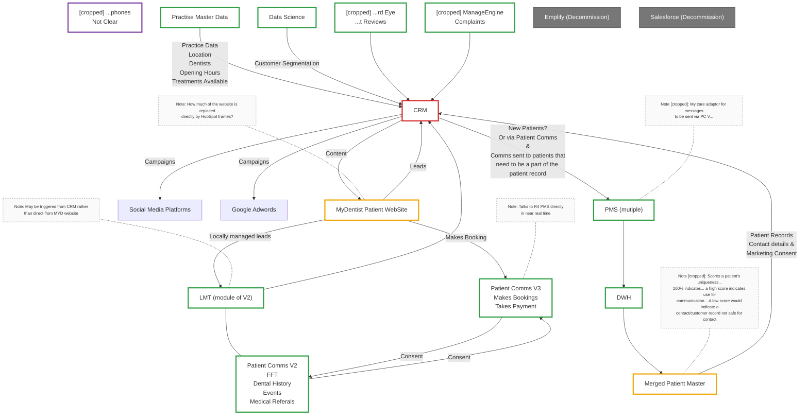

**Key:** Green – exists unchanged · Amber – exists changed · Red – New · Blue – Vendor provided · Grey – Decommission

This sketch is from the Architecture Assessment that went through TDA on the 19th May 2026:

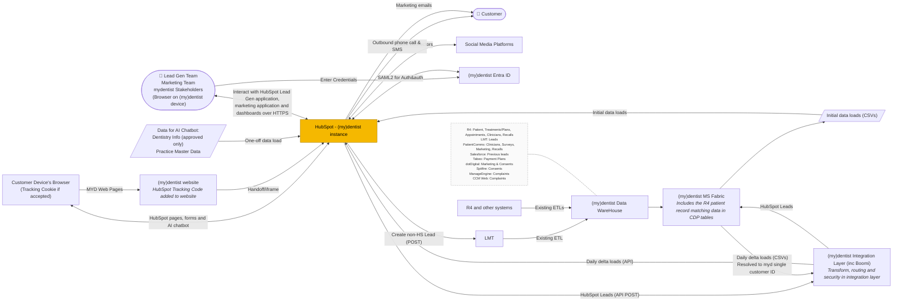

#### List of Business and System Actors in Context Diagram

| Name of System/Role | Role in Design | State (New / Amended / Existing / Retired) |
|---|---|---|
| CRM (HubSpot) | New Hub for Marketing, replacing dot Digital. New tool for calls for the Lead Gen Team. Tracking of Leads for the Lead Gen Team. Provides AI chatbot functionality for Teeth Straightening and Whitening pages of website. | New |
| {my}dentist Website | Existing website. Amended to incorporate the HubSpot Tracking code and cookies and to hand control off to HubSpot forms where appropriate as per the new UX design. | Amended |
| LMT | Existing Lead Gen tool. Will continue to manage all Leads not managed by HubSpot directly. HubSpot will have the ability to create Leads in LMT where it cannot work the Lead in this Phase. A new integration via Boomi will allow this to happen. (N.B: It will be amended in Phase 2, not 1) | Existing |
| R4 | Existing General Dentistry PMS. Will not be changed for this Phase. New bookings into R4 will continue to be done via existing systems and processes (e.g: Central Booking). Data will move from R4 to HubSpot via EDW and Fabric so no new data extracts from R4 is required. | Existing |
| Data Warehouse | The existing on-prem data warehouse (EDW) will continue to pull data from R4 instances and allow it to move to Fabric. | Existing |
| Fabric Data Lakehouse | The strategic data lakehouse for mydentist. New delta tables will allow data to move from Fabric to HubSpot. A new table will also be created to take data back from HubSpot. Also includes the CDP which matches customer/patient records which is required for the delta tables to ensure that HubSpot receives a unified view of customer, not fragmented. | Amended |
| Entra ID | mydentist's Active Directory. Allows all access to HubSpot to be authenticated and authorised using RBAC. | Existing |
| Salesforce | Previous tool for Lead gen team. Replaced by HubSpot. | Retired |
| dot Digital | Previous tool for marketing emails and allowing marketing opt-outs. Will be replaced by HubSpot | Retire |

---

### Integrations view

#### Customer Ingress Flows

##### The Teeth Straightening / Whitening Flow

This diagram from Chitra shows the current flow which allows for the customer to book an appointment to speak with the Lead Gen team:

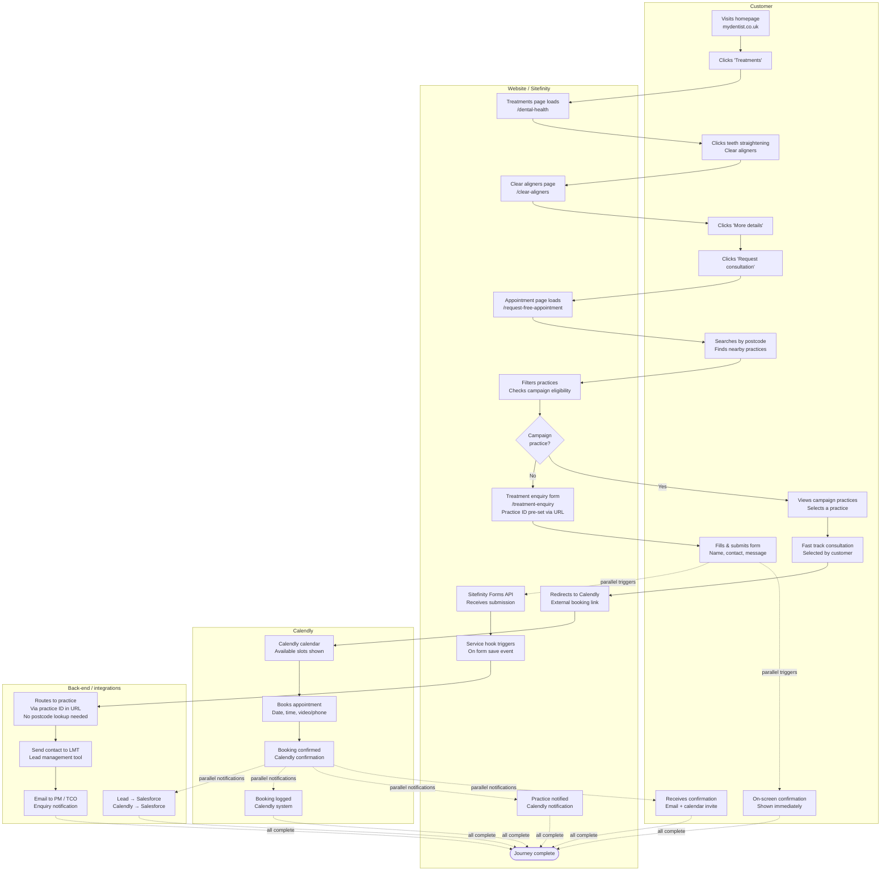

- Campaign practice → Fast track → Calendly (calendar straight away) → Book appointment → Salesforce
- No campaign practice → Treatment enquiry form (practice ID in URL) → Service hook → Routes to practice → LMT → PM/TCO email

The website flow will be replaced with one which hands most of the UI off to HubSpot forms and the calendar booking to a native HubSpot control which is integrated with the Lead Gen Team's Outlook Calendars via native HubSpot / Outlook connectors.

HubSpot can still pass the Lead onto LMT if needed. It will do so by calling the SiteFinity Forms API which we will wrap under a mydentist integration using APIM and Boomi. Please refer to that specific integration below for further details.

_TODO: The to-be diagram is expected from Huble in w/c 8th June 2026._

##### The General Enquiry Form

_Screenshot of the current form at `https://www.mydentist.co.uk/dentists/request-appointment` — "Make an enquiry":_

| Field | Type |
|---|---|
| First name * | Text |
| Last name * | Text |
| Phone number * | Text |
| Email * | Text |
| Date of birth * | Day (DD) / Month (MM) / Year (YYYY) |
| Postcode * | Text |
| Interested in * | Checkboxes: I would like more information on all treatments · Affordable private dentistry · Teeth whitening · Teeth straightening · Dental implants · Composite bonding · White fillings · Dentures / Bridges · Hygienist · Dental plan / Insurance · Facial aesthetics (line and wrinkle treatments) |
| Submit | Button, with privacy policy link below |

The current Website flow is shown here:

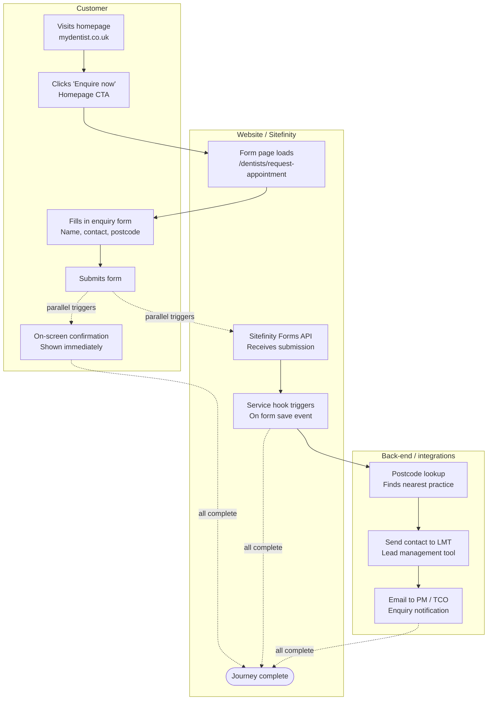

Currently, when this form is submitted, it is sent via API directly to LMT.

For Phase 1, this form will be replaced with a HubSpot form that looks similar and is branded correctly.

HubSpot will call the API to send the details on to create the Lead in LMT.

_TODO: The to-be diagram is expected from Huble in w/c 8th June 2026._

##### The Specific Treatment Enquiry Form

Alternatively a customer can browse lists of all available treatments and select to Enquire about a specific one. In this case a shortened form is displayed which does not have the tickboxes to select which treatments they are interested in.

_Screenshot: "Find a dental treatment" page with a "Make an enquiry" modal overlaid. Fields: First name\*, Last name\*, Phone number\*, Email\*, Date of birth\* (DD/MM/YYYY), Postcode\*, Submit button, privacy policy link._

The current Website flow is shown here:

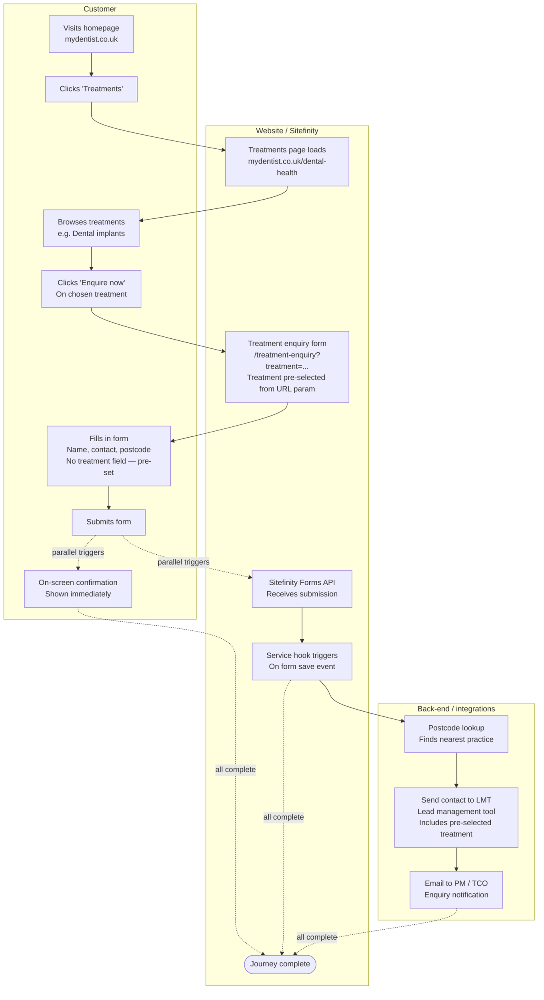

Currently, when this form is submitted, it is sent via API directly to LMT.

For Phase 1, this form will be replaced with a HubSpot form that looks similar and is branded correctly.

HubSpot will call the API to send the details on to create the Lead in LMT.

_TODO: The to-be diagram is expected from Huble in w/c 8th June 2026._

##### The Specific Practice Enquiry Form

The current Website flow is shown here:

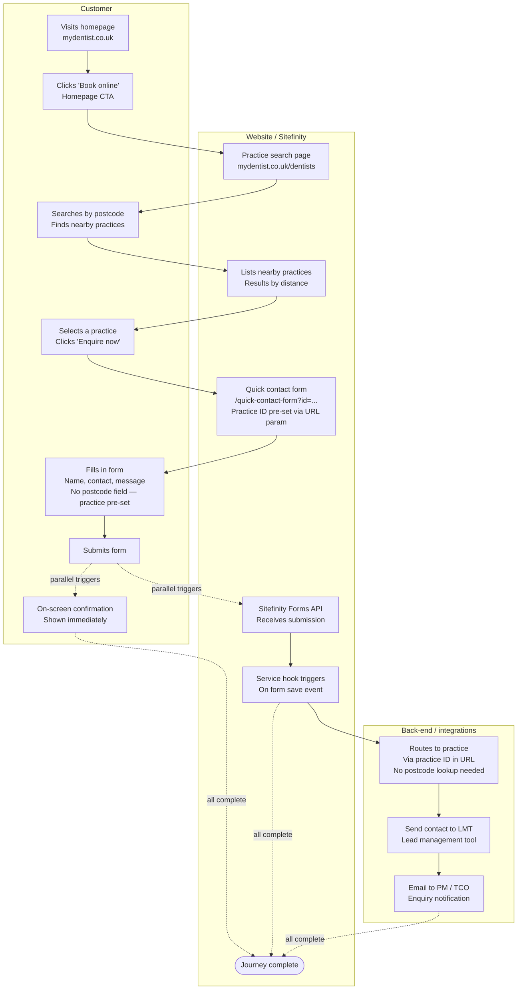

Currently, when this form is submitted, it is sent via API directly to LMT.

For Phase 1, this form will be replaced with a HubSpot form that looks similar and is branded correctly.

HubSpot will call the API to send the details on to create the Lead in LMT.

_TODO: The to-be diagram is expected from Huble in w/c 8th June 2026._

##### The Specific Service Enquiry Form

The current Website flow is shown here:

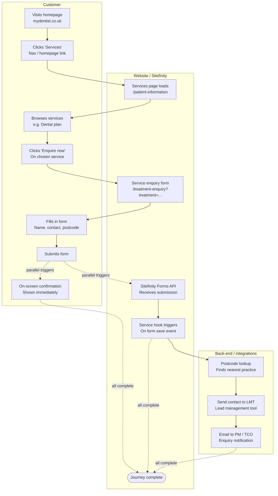

Currently, when this form is submitted, it is sent via API directly to LMT.

For Phase 1, this form will be replaced with a HubSpot form that looks similar and is branded correctly.

HubSpot will call the API to send the details on to create the Lead in LMT.

_TODO: The to-be diagram is expected from Huble in w/c 8th June 2026._

#### Data Flow into HubSpot from mydentist Fabric Lakehouse

The export tables will be built daily after their source tables (as listed above) are refreshed. The limiting factor for the earliest build time will be the R4 data which has to come through the EDW and is currently not available until around mid-day the following day to the data it covers. This will improve as changes to EDW and Fabric are made by the data team but we are designing on the assumption that this will not have happened by Phase 1. We can amend this to bring the data forward if this changes.

The export tables will be built by Stored Procedures from the source tables and be a delta of the source tables from the last export. A column in each export table will identify if each row is a CREATE, UPDATE or DELETE.

A series of scheduled tasks in Boomi will read each export table daily directly (JDBC connection with Managed Identity in our Entra ID) and store temporarily in an Azure SQL instance which will act as a store-and-forward database.

Then a series of threads will attempt to read data from the export tables and push into HubSpot APIs for each Object Type at a rate of 100 items per request. If the request is successful then all rows will be marked as successful in the Azure SQL table Boomi is using in a column for that purpose. If they were not successful then the rows will be marked as such and retried on an exponential backoff strategy if the return code indicates that that is appropriate (e.g: HTTP return code 429 or 500+).

This will be achieved using the native Boomi to HubSpot connector: [HubSpot CRM connector | Boomi Documentation]

_TODO: Need to fully agree with Huble which return codes should be retried and which should not. Also need clarity on if we can get multipart status return where we can mark some of our rows as sent and some as not sent. Is all of this covered by the native connection?_

| Source Table | Export Table | HubSpot Object |
|---|---|---|
| Dim_Patient | Contact | Contact Object |
| Fact_Consent | Contact | Contact Object |
| Fact_Patient_Balance | Contact | Contact Object |
| Fact_Patient_Recall_Status_History | Contact | Contact Object |
| Dim_Staff | Contact | Contact Object |
| Fact_Patient_Recall_Status | Contact | Contact Object |
| Dim_Patient | Patient | Custom Object (Patient) |
| Fact_Enquiry | Lead | Lead Object |
| Dim_Staff | Clinician | Custom Object (Clinician) |
| Fact_Treatment_Courses | Treatment | Opportunity Object |
| Fact_Treatment_Items | Treatment | Opportunity Object |
| Fact_Appointment | Appointment | Appointment Object |
| Patient_Comms_Online_Booking_Requests | Appointment | Appointment Object |
| Fact_All_Interaction | Activity | Activity Object |
| Dim_Membership_Plan | Product | Product Object |
| Dim_Membership_Patient | Subscription | Subscription Object |
| Fact_Membership_Detail | Subscription | Subscription Object |
| Dim_Practice | Company | Company Object |

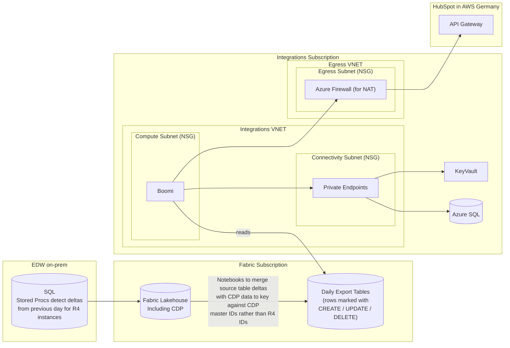

Link to detailed Data Mapping: [Huble Solution Design / CRM Mapping](https://idhgroup.sharepoint.com/:f:/r/sites/PhoenixProgrammeDoc/Shared%20Documents/02.%20Programmes%20%26%20Projects/04.%20Customer/01.%20Customer%20Relationship%20Management%20(CRM)/Design/Huble%20Design/Huble%20Solution%20Design/CRM%20Mapping?csf=1&web=1&e=FlsB6i)

#### Sequence Diagram for flow from HubSpot to mydentist

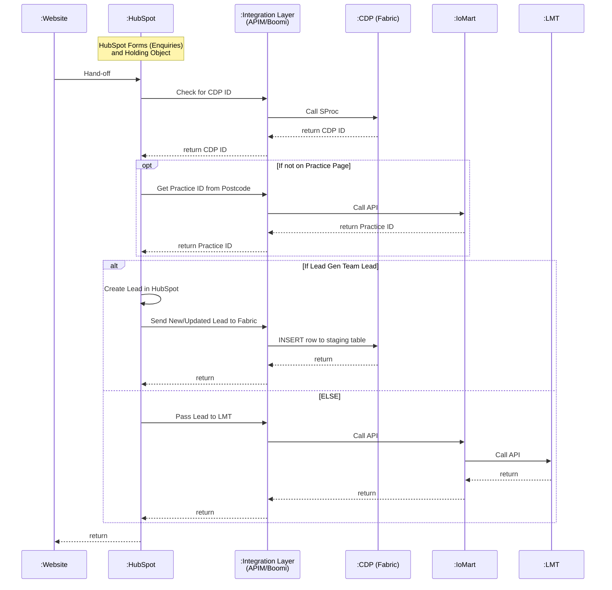

> _In the source the second block is drawn as an OPT with an ELSE branch; it is rendered here as `alt/else`, which is the equivalent Mermaid construct._

The 4 individual integrations through the Integration Layer are covered in more detail below.

#### Check CDP for Existing Customer

This new API will allow HubSpot to check in CDP if a set of contact details entered into a form (name, DoB etc…) can be matched to an existing customer record in CDP.

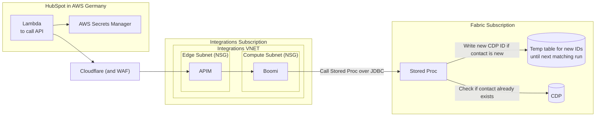

If the Proc determines that the details can be matched to an existing CDP record then the API will return the CDP Master ID to HubSpot.

If the Proc determines that the contact details are a new customer then it checks the existing CDP table and the temp table to determine what the next CDP Master ID is to allocate and stores it in the temp table before returning that ID back to the caller, HubSpot. Since this is sensitive to race conditions if two calls are made to the proc at the same time then locking will be implemented in the proc. If a call comes into the proc whilst the lock is in place then it will be returned with a code to tell Boomi that the proc could not be executed at this time and Boomi will retry on an exponential back-off. Since the volume of calls to the API is not expected to be many per second this is not likely to cause any problems.

#### Find Practice from Postcode

We will NOT wrap the existing API under our integration layer (APIM & Boomi) for HubSpot to call when it needs to resolve a Postcode to the nearest Practice ID. This was what we were planning to do until we realised (Alex informed us) that this is not the full story on how Leads are allocated from the website to LMT. It would miss a step where a check is made against a table maintained by Jack that contains the Practice IDs of practices that are due to close and the Practice ID where their Leads should be redirected to. Although we would still get this if we passed a Lead onto LMT, as the check is done in that wrapper, we would miss it if the Lead was worked in HubSpot. Therefore we are creating a new endpoint, alongside the existing postcode check in IoMart that orchestrates the postcode lookup with a check against the aforementioned table and a check against Practice Directory table that can check if a treatment is actually offered at that practice. Therefore the pattern looks the same but the endpoint is a new one:

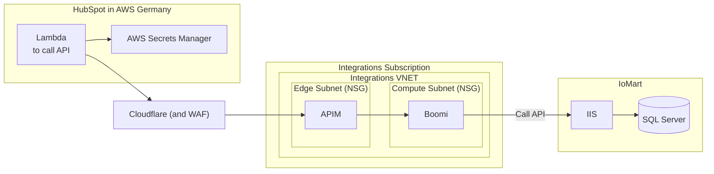

NB: We built this into the existing on-prem stack rather than building a new API as the functionality is Practice Directory related. A separate project will pick up the task of relocating Practice Directory into the cloud in 2027.

#### Data Flow from HubSpot back to mydentist Fabric Lakehouse

HubSpot will be configured to make an API call into mydentist whenever a new Lead is created on its side via an HTTPS POST into a new API exposed via APIM in the mydentist Integration Subscription in Azure. It will use keys and secrets stored securely in AWS in AWS Secrets Manager, which is the equivalent of Azure Key Vault and is designed for this purpose.

The payload will pass a HubSpot Lead ID and a HubSpot Contact ID as the primary identifiers.

If HubSpot considers the Contact ID as new, the payload includes an optional element with contact details: names, address, date of birth, email, and phone number.

This data will be transformed by Boomi into SQL INSERTs into an import table in Fabric. Fabric will periodically process the contents of the table via a Notebook to load them into CDP. CDP will create a new master customer identifier for any new customer and store it against the HubSpot Contact ID. If an appointment comes into an R4 diary later which CDP determines to be the same customer then it will link that R4 record against the same master customer identifier (and thus the HubSpot Contact ID too). N.B: This process will be tightened up in Phase 3 when HubSpot will be able to create appointments itself in R4 via our Integrations into the MyCare layer and using CDP data directly as part of an orchestration.

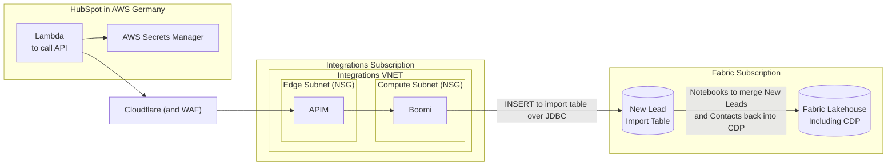

#### Call to Internal API to send Lead to LMT (via our Integration Layer)

We will wrap the existing API under our integration layer (APIM & Boomi) for HubSpot to call when it needs to pass a Lead onto LMT.

Current API URL: `https://apinew.mydentist.co.uk/SitefinityForms.Api/v1/sitefinity/webforms`

This is a mydentist API which is located in IoMart.

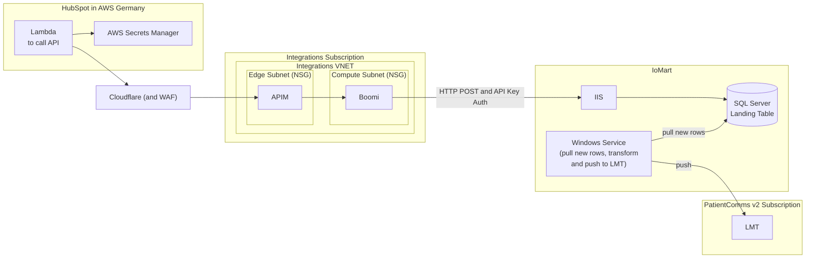

Going through the mydentist API rather than directly to LMT sorts out some of the data mappings, looks up postcode where necessary and emails the practice that there is a new lead in LMT.

(underlying LMT URL for info: `POST site/{siteId}/dentalhistory/webform`)

This will be enhanced in Phase 2 to allow the HubSpot Lead ID to be passed into LMT as a new parameter as well as creating new APIs to allow Leads to sync between HubSpot and LMT so that all Leads can be viewed in either system with real-time updates.

---

### System Changes

#### Website

##### Tracking Code

The website is implemented in Sitefinity CMS hosted in IoMart. The HubSpot Tracking Code can be added to its templates so that it is included in all our pages: [Install the HubSpot tracking code]

NOTE: If the customer does not accept cookies the tracking cannot work. This is by design and is to comply with our legal obligations.

Cookies will continue to be managed by OneTrust.

##### Customer Journey Changes

We will also need amend the website to link to the HubSpot forms. These flows have already been described in the Integrations section of this document.

##### Domain Linking

So that HubSpot forms and the HubSpot Preference Centre can be seen to be on the mydentist domain we will need to configure DNS. Guide linked here: [Connect a domain to HubSpot]

(NOTE: We have not yet decided whether we will assign a specific subdomain of mydentist.co.uk to HubSpot so further work is required here.)

##### AI Chatbot

For Phase 1 this will be limited to Teeth Straightening ONLY and will only be available on the mydentist webpages dedicated to those services.

The chatbot will be configured entirely within HubSpot. The mydentist website developers will be provided with the necessary code snippets to link to the HubSpot URL which surfaces the Chatbot.

The Huble proposal for how the Chatbot will be configured is linked below:

[mydentist _ AI Agent Info for Solution Design Approval.docx](https://idhgroup.sharepoint.com/:w:/r/sites/PhoenixProgrammeDoc/_layouts/15/Doc.aspx?sourcedoc=%7B4212CAC2-768A-4191-86E5-8C5F3C30D564%7D&file=mydentist%20_%20AI%20Agent%20Info%20for%20Solution%20Design%20Approval.docx&action=default&mobileredirect=true)

I.E: Described as Agent 1 in the above document. Agent 2 is not in Scope for Phase 1 and Agent 3 is just a native HubSpot capability for users.

A detailed list of all its data sources will be created as part of detailed design for reference. No data sources will be included without specifically documenting the fact.

It will also be subject to strict testing for suitability (heavily leaning on Cliff Davies (Unlicensed) here)

> **IMPORTANT NOTE:** The Chatbot is strictly limited in what it knows and what it is allowed to talk about by design (please refer to the linked document for more details.) It will not have access to ANY customer or patient data (for Phase 1 at least and changing that will be a significant change that requires new approvals and is not approved by approving this CAD). It will also be forbidden from giving medical advice or discussing any other treatments or NHS availability.

---

### Platform Configuration

#### HubSpot

##### Duplicate Contact Solution

As mentioned previously, HubSpot natively uses Contact email address as the primary key for Contacts. This is not changeable. That means, for instance, if we use a standard HubSpot form to collect customer enquiries and that form includes the email address then any other fields collected in the form will be logged against the one and only Contact that has that email address. In situations such as those we have in mydentist where the email address is shared then the one Contact that has the email address could be corrupted by data from the other.

For example if a husband and wife have the email address familysmith@gmail.com then, for one thing, all the data ingested into HubSpot from R4 would have been merged under one record. Even if we had integration processes to get round this (which we will do) by suppressing the email address for one of the customers when it is sent into HubSpot, then it will still cause a problem on form submission. If we had decided that the wife 'gets' the email address in HubSpot and the husband does not, then, if the husband subsequently came along and made an enquiry using the shared email address but his name and mobile number, then the wife's details would be overwritten with the husband's in HubSpot.

The only way to get round this is not to use native, contact-based, forms, but custom forms which capture the data into a 'holding-object' before executing logic on the data to decide what to do with it.

This, and the processes we need to follow to safely ingest data from CDP are covered in this solution from Huble:

[mydentist _ Duplicate Contacts and Edge Cases Solution Proposal.pptx](https://idhgroup.sharepoint.com/:p:/r/sites/PhoenixProgrammeDoc/_layouts/15/Doc.aspx?sourcedoc=%7B430095D4-04D3-4C97-944E-281509CC6584%7D&file=mydentist%20_%20Duplicate%20Contacts%20and%20Edge%20Cases%20Solution%20Proposal.pptx&action=edit&mobileredirect=true&DefaultItemOpen=1&web=1)

The flow for the holding object logic on form submission is here (as previously seen in the integration section): see [Sequence Diagram for flow from HubSpot to mydentist](#sequence-diagram-for-flow-from-hubspot-to-mydentist).

---

### Security view

#### Encryption

- HubSpot uses TLS 1.2 and 1.3 for HTTPS traffic including APIs and web client.
- HubSpot encrypts data at rest using AES-256 including an extra layer of AES-256 with customer-specific keys for PII / sensitive data.
- APIM's inbound connections will use TLS 1.3 which has been standard since 2024.
- Azure SQL encrypts data at rest using TDE.
- Fabric Lakehouse encrypts data at rest using ADLSv2's automatic encryption on write.

#### HubSpot Secrets / Keys

- Keys to connect to HubSpot API for Boomi will be stored in Azure Key Vault in our Integration Azure Subscription.
- Keys to connect to mydentist API from HubSpot will be stored in AWS Secrets Manager in HubSpot's AWS account.

#### Colleague Authentication and Authorisation

All access for mydentist colleagues to the Prod HubSpot instance will be via federated authentication into our Entra ID (formerly Azure AD) instance. I.E: Single Sign-on. Colleagues must enter their mydentist email and password and our Entra ID will validate the credential, not HubSpot. Entra ID will inform HubSpot if the sign-on was successful via SAML2.0 and, if successful, will provide an identity back to HubSpot detailing the colleague's username and which AD groups they are a member of which will be used to authorise access to certain parts of the application based on their role. I.E: RBAC.

SAML2 federation is a native capability of both Entra ID and HubSpot and therefore only configuration is required to link them.

Colleagues will not be allowed to access HubSpot using shared Entra ID logins. Only those with individual accounts will be in the AD Groups that grant access. This is a contractual and architectural limitation not a technical one but it is one we will comply with.

_TODO: Will need to define exact AD Group to Functions mapping as part of detailed design…_

#### Any Other Security Considerations

_TODO: Link to Security Assessment? Will such a thing exist?…_

---

### Data view

#### Marketing Consent Initial Load to HubSpot

There will be an initial load via CSVs into HubSpot for Day 1 of the marketing consent position of all {my}dentist's customers / patients. This will be built up from the several historic data sources in EDW / Fabric (sourced from other systems originally) which the data team will roll up into the following table:

`CRM_vw_Fact_Consent`

The principle being that where a customer has previously filled in a form expressing interest in any treatments or services then we will treat those as having opted in. We will overlay with any opt-outs that have been recorded in dotDigital or Spitfire previously. Those opt-ins and opt-outs will be timestamped and the job to overlay the data will use the opt-in or out with the latest timestamp per customer. The data from the various sources will be linked together by CDP mappings.

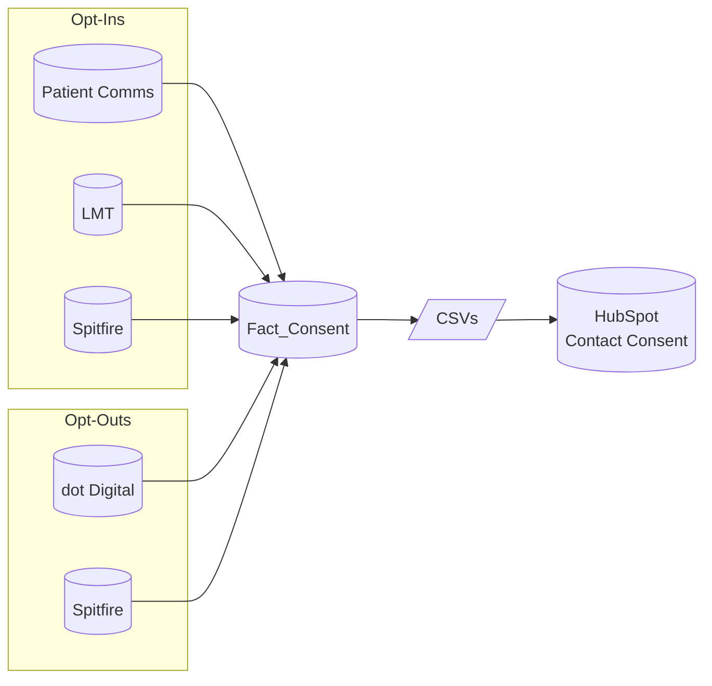

> **Robert Hyman** _do we have a techdesign for this?_

#### Marketing Consent Flow in HubSpot

Once HubSpot is live then we will change how marketing consent works as HubSpot will hold the master marketing consent flags, originally based on the initial load as per the above.

When a new customer comes into mydentist via an Enquiry Form or a booking to talk to a Lead Gen agent then we will have collected an email address. Even if the Lead was passed into LMT then it will have been submitted to HubSpot first, creating a new contact with an email address, before HubSpot calls the LMT API to create the Lead in LMT and 'suspending' the HubSpot Lead.

HubSpot will always then send an acknowledgement email. Either acknowledgement of the enquiry or acknowledgement of the consult booking with the Lead gen team. This email will contain the option to click a link to manage preferences, including the option to opt out of marketing.

We MUST do this as we are taking either flow as an expression of interest in mydentist's services and treating that as a 'soft-opt-in'. Legally we can do this as long as we provide them the ability to opt-out again if they wish. Since we have no ability to sign in to our website and opt-out there we can only do this via an email.

The email will contain a link to a HubSpot URL (we should mask this behind mydentist.co.uk) where the URL includes the HubSpot customer ID in it. That URL will present the customer's Preference Centre. There they can opt in and out of marketing about various services (exact groupings to be defined) as well as having the option to opt out of ALL marketing, which is a legal requirement.

If the customer chooses not to act on the opt-out presented to them in the email then we are safe to treat them as opted into marketing until such time as they notify us otherwise.

Changes to a customer's consent status should come through on the contact feed (see Integrations section) from HubSpot so that we can mirror it in CDP.

Any Enquiries or Forms submitted by customers / patients in future will NOT opt them out of marketing if they do not select any areas of interest. These will be taken purely as expressions of interest which we will store in Fabric as such. We will not treat any of them as withdrawal of marketing consent. This can only be done explicitly in the preference centre.

NOTE: We will need to determine a business process for if a customer / patient asks someone in Practice to remove them from Marketing or if they ask Patient Services. We are assuming for now that Patient Services will have access to do so via HubSpot UI after verifying the customer's identity and that Practices can signpost patients to Patient Services. Business process is yet to be defined though.

See the document from Daniele for more details on the proposal:

[Marketing Permissions - HubSpot.docx](https://idhgroup-my.sharepoint.com/:w:/r/personal/dmercante_mydentist_co_uk/_layouts/15/Doc.aspx?sourcedoc=%7BA38CDEE4-9001-4B88-9A20-10F7A493C993%7D&file=Marketing%20Permissions%20-%20HubSpot.docx&fromShare=true&action=default&mobileredirect=true)

#### Duplicate Email Suppression

We have several cases where we store the same email address for multiple patients. E.g:

- Husband and wife who share an email address.
- Children whose contact detail is a parent and therefore have the parent's email address against their patient record.
- People in care homes where the care home holds the contact details on their behalf.

HubSpot natively merges all records supplied to it where the email address is the same. This would mean, for instance, that updates to parent and children data would overwrite each other leading to incorrect data being held in HubSpot and DPA breaches. This is true even if we attempt to use the CDP Master ID as a de-dupe key. It doesn't stop the default behaviour.

For Phase 1 we will work around this limitation while Huble and HubSpot look at customisation of the platform to fix the problem.

This workaround will be implemented in the layer before the data hits HubSpot, namely CDP and Boomi.

At a very high level it will involve CDP identifying different cases where duplicate email address is present and why such as people in same household, children, care homes etc. This data will be passed to HubSpot against the contact record by Boomi as custom properties of the contact record. In addition, the email address will be suppressed for all, or all-but-one, of the contact records, so that HubSpot never sees a duplicate email address.

The proposal for the CDP and Boomi logic to address this is linked here:

[mydentist - Edge Cases and Duplicate Email Resolution Functional Specification.docx](https://idhgroup.sharepoint.com/:w:/r/sites/PhoenixProgrammeDoc/_layouts/15/Doc.aspx?sourcedoc=%7B13D5CE01-DA2A-47C1-BF90-B24A9ADBE429%7D&file=mydentist%20-%20Edge%20Cases%20and%20Duplicate%20Email%20Resolution%20Functional%20Specification.docx&action=default&mobileredirect=true)

For Phase 1 this is acceptable as the outbound contacts from HubSpot will be for marketing. We must not market to children, we would not wish to market to care homes and for shared adult households we can choose to market only to the most active lead individual. Therefore it is not a significant inhibitor of the business case for marketing.

However, when we wish to move to service messaging over email in future phases it will be a significant hindrance. It _must_ be addressed differently as we move more processes to HubSpot.

#### Data Model in HubSpot

As opposed to HubSpot (the product's) own data model, this is the data model for how mydentist's data is represented in our HubSpot instance:

> _Diagram provided by Huble. Relationship lines in the source image overlap; links below are a best-effort reading. Recall and Staff are shown in blue in the original (all others green)._

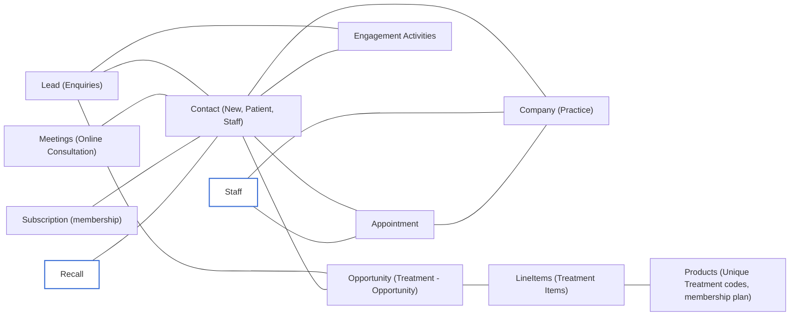

#### Test Data

Data in environments other than Prod will be anonymised. Details for how this will be achieved will be laid out in test prep plans, not here.

#### DPIA Assessment

This is in progress with Paul Stenton-Parker (Unlicensed).

_TODO: Link to DPIA._

#### Any Other Data Considerations

_TODO: Need Logical Data Models for Delta Tables and HubSpot→CDP table._

---

### Infrastructure View

#### HubSpot

HubSpot is hosted in AWS in Germany. As a SaaS product we are not responsible for the infrastructure and therefore it is not included here.

#### Integration Layer

Our integration layer is hosted in its own Azure subscription in the mydentist tenant. NB: Prod is completely separate from test instances also. Only Prod lives in the Prod subscription.

It follows the infrastructure patterns as outlined in the Integration standard using Cloudflare, Azure PaaS services and Boomi:

[Integration standard (ITArchitecture)](https://idhgroup.sharepoint.com/:b:/s/ITArchitecture/IQAMDp2ZNzb8TbWNbrhU26O5AZV_dpAgxq1eUNwu3z0tdsA?e=R5YMPa)

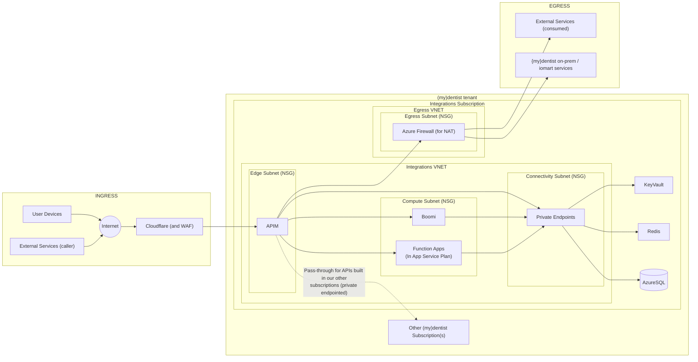

#### MyDentist Website

The mydentist website is implemented using the SiteFinity CMS hosted by SiteFinity as PaaS and mydentist form submission processing hosted in IoMart datacentre. This is not changing for this project so please refer to previous documentation.

Diagram from Alex:

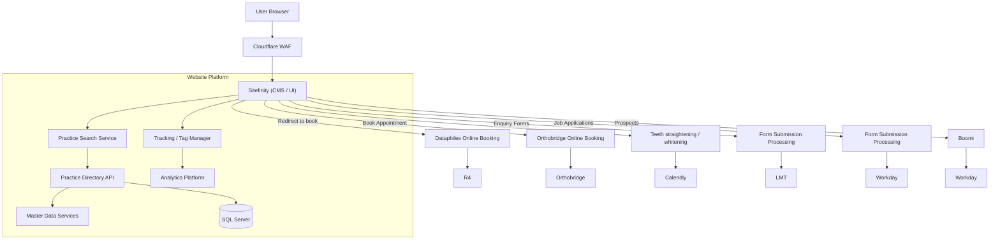

#### R4

R4 is a traditional client-server application. The client is hosted on the in-practice PCs and uses a mixture of VB6 and .NET components. The server is SQL Server hosted on Windows Server on-prem in the practice itself. This is not changing for this project and is therefore not covered here at all.

---

### Support & Maintenance view

_TODO: Link to Service Transition documentation. Need to speak to James B…_

_TODO: Table of owners of components in Prod_

_TODO: Description of Hypercare period_

---

## Decisions Pending or Made

| Field | Value |
|---|---|
| **Name** | How to populate HubSpot with patient interactions from R4 on an ongoing basis and allow HubSpot to create some R4 data (Appointments, Customers, Interaction History) |
| **Date Raised** | Mar 6, 2026 |
| **Options Considered** | 1.) Use Carestream API (Partner API / Sensei API) 2.) Use Dataphiles Adaptor (MyCare) 3.) Use Data Warehouse (via Fabric) 4.) Use Carestream API but with Dataphiles adaptor handling connection to R4 (late option after negotiation between CS and DP). |
| **Option Chosen** | 3 for now. We will move to 4 in Phase 3. |
| **Reason** | We do not have the timescales to develop and deploy new APIs to connect HubSpot to Carestream's Partner API or Dataphiles' MyCare Adaptor in time for Phase 1.  For future phases, although we initially preferred option 3 due to lower quoted cost and greater confidence in DP to deliver on-time and to expected quality, this option was ruled out by CS as it is against their strategy and the contractual agreements they have with DP.  After lengthy negotiations with all parties a hybrid approach was agreed where CS will deliver the API that mydentist connects to and DP will deliver the connectivity into R4 which we know works and doesn't cause R4 performance problems. |
| **Implications of Decision** | We will redesign some of the data flow for Phase 3 to use the agreed interface pattern. |
| **Who has been Informed** | Project Team, Pete Bailey, Simon Tucker, Neil Ritchie |
| **Who Decided** | Michelle Howchin, Carestream senior team, Dataphiles senior team. |
| **Date Decided** | Jun 25, 2026 |

## Assumptions, Risks, Issues, Dependencies

Capture unresolved questions and decisions for governance.

| Item | Description / impact | Owner |
|---|---|---|
| RISK | [Key risk and mitigation]. | [Add Owner] |
| ASSUMPTION | [Assumption made, implications and how to confirm]. | [Add Owner] |

## Implementation Outline

Proposed milestones, dependencies, and validation activities.

1. Technical spikes / proofs-of-concept: [areas to de-risk].
2. Milestones: [architecture sign-off] → [MVP] → [rollout].
3. Operational readiness: runbooks, alerts, SLOs, dashboards.

---

## References and Related Artefacts

### Existing Architecture Docs

[ITArchitecture - existing architecture docs](https://idhgroup.sharepoint.com/:u:/r/sites/ITArchitecture/_layouts/15/Doc.aspx?sourcedoc=%7Ba709bf6d-4227-4e0f-92fb-7c51f45d1b07%7D&action=edit&wdIsModeSwitch=1&or=PrevEdit&CID=dd78b560-143c-4f81-a114-6ba45c667fa2)

### Standards and Guardrails Compliance

| Name of Standard | Link to Standard | Compliant? (Y/N/Waivered) | Comments |
|---|---|---|---|
| Authentication Methods for Technical Service Connectivity Standard | [Link](https://idhgroup.sharepoint.com/:b:/s/ITArchitecture/IQDc3P8sXSLST5xAJCN3mZNCARYSk8nPH3nC3BYtLZz1v1U?e=mRn1S7) | tbc | |
| Connected Systems Standard (API Gateway & Integration) | [Link](https://idhgroup.sharepoint.com/:b:/s/ITArchitecture/IQAMDp2ZNzb8TbWNbrhU26O5AZV_dpAgxq1eUNwu3z0tdsA?e=k2djYo) | tbc | |

---

## TDA Feedback Tracker

| Date Raised | Raised By | Discussion | Steps to address / mitigate |
|---|---|---|---|
| Jun 16, 2026 | Adrian Wells, James Hoodless | **AW:** The duplicate email solution feels critical to the solution but isn't finalised here. Does that invalidate the solution as a whole?  **JH:** The data team is not comfortable with the current solution proposal for duplicate emails from Huble and wants to push back on that solution.  **RW:** Understood. However, unless we decide to abandon HubSpot completely then most of the design will still be correct hence we are seeking approval of the rest of the design. | We need to continue working on this part of the solution (and the telephony for Lead Gen team) and bring back the design for re-approval in the coming weeks. |
| Jun 16, 2026 | Paddy Broderick | TDA is happy to conditionally approve this design with the known caveats which must be re-presented at a future TDA. | N/A |
