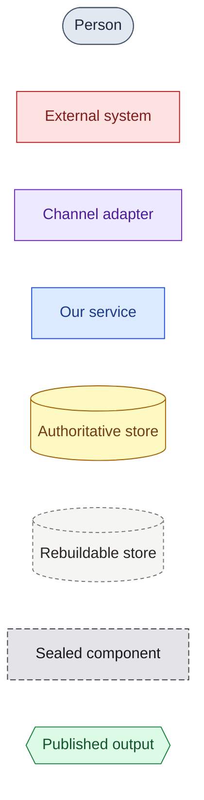

# Diagram Conventions

One consistent visual language so every diagram in the discovery reads as part of the same system.

**Why this matters:** in a discovery phase the diagrams *are* the evidence, not decoration. They
carry what we found, what we are proposing, and which questions are still open — and they are read
by people deciding whether to fund the next phase. Expect C4 (Context, Container, Component) views
plus sequence diagrams for every non-trivial cross-service flow, alongside current-state and
option-comparison views. These conventions exist so all of that lands consistently, and so the set
survives into delivery without being redrawn.

---

## Hard-won lessons (do not relearn these)

1. **Do not use Mermaid's native `C4Context` / `C4Container` renderers.** They were tried on a
   previous engagement and dropped: the auto-layout produces tangled, crossing diagonal lines that a
   non-technical audience cannot follow. **Use `flowchart TB` styled to look like C4** — same
   semantics, lanes you control, short mostly-non-crossing edges.

2. **Render before shipping.** A diagram that doesn't compile is worse than no diagram. Every block
   gets rendered with `mermaid-cli` and eyeballed before it goes in a document (see *Workflow*).

3. **Repeat the `classDef` block in every diagram.** Diagrams get copied into decks, tickets and
   emails. Each one must render standalone.

4. **One diagram, one claim.** If you can't write the caption in a sentence, split it.

5. **Style subgraphs separately.** `classDef` + `class` styles *nodes*; subgraph containers need
   their own `style <id> fill:…,stroke:…`.

6. **Caption every diagram** in italics underneath. Add a legend table only when the diagram is
   complex enough to need one.

### Gotchas found the hard way

- **`direction LR` inside a subgraph is ignored** when nodes in that subgraph have edges to nodes
  outside it. The subgraph silently stacks vertically and your diagram comes out as a thin ribbon.
  Fix: set the direction at the top level (`flowchart LR`) instead of fighting it per-subgraph.
- **Don't quote participant aliases in sequence diagrams.** `participant A as "My Service"` renders
  the quotation marks literally. Write `participant A as My Service`. Parentheses are fine unquoted.
- **A semicolon inside `Note` text breaks a sequence diagram.** It is parsed as a statement
  separator, and the failure surfaces as a bare `Parser.parseError` with no line number. Use an
  em dash or a comma. Slashes, question marks and `<br/>` are all fine.
- **Bisecting a broken diagram by truncating lines does not work** — cutting inside a `rect`, `alt`
  or `subgraph` removes its `end` and every truncation fails. Remove whole blocks instead.
- **`A & B & C --> D`** is valid and much cleaner than three separate edge lines for a fan-in.
- **Bidirectional edges (`<-->`) with a label are ambiguous** about which direction the label
  describes. Use two labelled single edges when the direction matters.
- **Two parallel edges between the same pair stack their labels on top of each other**, rendering
  both unreadable. Merge them into one edge with a combined label.
- **Check the aspect ratio, not just that it compiled.** Anything past roughly 3:1 in either
  direction is going to be unreadable on a slide. Re-lay it out.
- **Never draw an edge to or from a `subgraph`** — always to its nodes. A group-targeted edge gives
  the layout engine nothing to rank on, and it drags one arbitrary member of the group out of
  position. Worse, an edge *into* a group whose members also point outward creates a cycle, which
  dagre resolves by relocating a node — so a source ends up below the thing it feeds. This has
  caused three separate broken layouts; it is the single most common cause.
- **Don't re-enumerate external systems at Container level.** Nine separate external nodes produced
  one row on the far edge with every edge snaking back across the canvas. Collapse them into a
  single node listing them; the Context diagram already carries the detail, and repeating it is the
  mixing-levels mistake.
- **Check edge direction reads as a sentence.** `ui --> person` claims the interface outputs to
  people. It is `person --> ui`. Easy to get backwards and invisible until you read the render.
- **`--force` dirties every rendered file.** Mermaid embeds non-deterministic ids, so re-rendering
  unchanged sources still produces different bytes. The default incremental mode avoids this. After
  a forced render, check `git status` and revert anything whose source did not change.

---

## Palette

Eight roles. Copy this block verbatim into each diagram and delete the classes you don't use.

```text
classDef actor    fill:#e2e8f0,stroke:#475569,color:#1e293b;
classDef external fill:#fee2e2,stroke:#b91c1c,color:#7f1d1d;
classDef adapter  fill:#ede9fe,stroke:#6d28d9,color:#4c1d95;
classDef service  fill:#dbeafe,stroke:#1d4ed8,color:#1e3a8a;
classDef truth    fill:#fef9c3,stroke:#a16207,color:#713f12;
classDef cache    fill:#f5f5f4,stroke:#78716c,color:#292524,stroke-dasharray:4 3;
classDef blackbox fill:#e4e4e7,stroke:#3f3f46,color:#18181b,stroke-dasharray:6 3;
classDef output   fill:#dcfce7,stroke:#15803d,color:#14532d;
```

| Class | Colour | Means |
|---|---|---|
| `actor` | Slate | People — the human roles who use or operate the system |
| `external` | Red | Systems we don't control — third-party platforms, systems of record |
| `adapter` | Violet | Channel adapters and ingress — the only place vendor dialects live |
| `service` | Blue | Our services — the components we build and deploy |
| `truth` | Amber | Authoritative stores — the ones you cannot rebuild |
| `cache` | Stone, dashed | Rebuildable stores — derived data, indexes, projections |
| `blackbox` | Zinc, dashed | Components sealed behind a contract — AI, vendor engines |
| `output` | Green | Publication — topics, feeds, exported files |

The dashed borders are doing real work: **dashed = can be deleted and rebuilt, or is not ours to
reason about.** Keep that distinction visible at a glance; on most systems it is the load-bearing
part of the architecture.

---

## Node shapes

Shape carries meaning too, so a reader can decode a diagram without the legend.

| Syntax | Shape | Use for |
|---|---|---|
| `A([Operator])` | Stadium | Person or external actor |
| `B[Ingestion service]` | Rectangle | Service or component |
| `C[[Review screen]]` | Subroutine | User interface |
| `D[(Archive)]` | Cylinder | Data store |
| `E{{Kafka topic}}` | Hexagon | Queue, bus, or edge |
| `F{Structured?}` | Diamond | Decision — e.g. a triage gate |
| `G((Delivery landed))` | Circle | Event |

Inline class syntax `A([Operator]):::actor` is more compact than a separate `class` statement.
Use it when there are only a few nodes; use `class a,b,c actor;` when there are many.

---

## Edges

| Syntax | Means |
|---|---|
| `-->` | Primary flow |
| `-.->` | Cross-cutting, asynchronous, or secondary — identity, audit taps, error paths, external handoffs |
| `~~~` | **Invisible.** Layout only — forces ordering without implying a relationship |
| `==>` | Emphasis — reserve for the one edge the diagram is about |

**Always label an edge with a verb.** `A -->|"archives bytes"| B` is information;
`A --> B` is "related somehow". This is the single highest-value habit in the whole convention set.

---

## Diagram types, and when to reach for each

| Type | Use for | Notes |
|---|---|---|
| `flowchart TB` | C4 Context and Container, whole-system views | Lanes as `subgraph`. Top-to-bottom keeps edges short |
| `flowchart LR` | Pipelines, per-channel adapter flows | Natural for left-to-right processing |
| `sequenceDiagram` | Cross-service flows | Use `autonumber`; group phases with `rect rgb(...)` + `Note over` |
| `stateDiagram-v2` | Lifecycles — record states, review states | Label every transition with its trigger |
| `erDiagram` | Data model | Include PK/FK and label relationships |

Not used on this project: `gantt`, `pie`, `journey`, `quadrantChart`. If one seems necessary, it
probably belongs in a slide, not the architecture set.

### Patterns particular to discovery

Discovery output is not only a target architecture. Three recurring shapes:

| Pattern | What it shows | How to draw it |
|---|---|---|
| **Current state** | The estate as it is today, including the parts that are painful | Same palette. Use `external` liberally — in a legacy estate most boxes are not ours. Do not sketch the target on the same canvas |
| **Option comparison** | Two or three viable mechanisms for the same job | One diagram per option, identical layout and node positions, so the reader compares by spotting the difference rather than re-reading. Caption each with its trade-off in a sentence |
| **Spike finding** | What a technical spike established, and what it did not | Draw only the path the spike actually exercised. Mark anything unproven with the `blackbox` class — dashed means "not ours to reason about", which is exactly what an open question is |

**Keep current state and target state strictly separate.** One canvas carrying both is the fastest
way to have a client believe something is already built. If they must be seen together, put them
side by side as two captioned diagrams, never as one.

**An unresolved question is a diagram element, not a footnote.** Discovery earns its fee by naming
what is still unknown. A diagram that hides the unknowns inside confident solid boxes is
misrepresenting the state of the work.

### Sequence-diagram phase bands

The technique worth copying — it turns a 50-step sequence into something readable:

```text
rect rgb(219,234,254)
    Note over Adapter,Archive: 1 — Receive and archive
    ...steps...
end
rect rgb(220,252,231)
    Note over Parse,Derived: 2 — Parse
    ...steps...
end
```

Band colours: blue `rgb(219,234,254)`, green `rgb(220,252,231)`, amber `rgb(254,243,199)`,
violet `rgb(237,233,254)`.

---

## Workflow

Diagrams live in three parallel folders — one hand-edited, two generated:

```text
docs/diagrams/
  mermaid/    *.mmd   hand-edited sources
  svg/        *.svg   generated — what the deck embeds
  png/        *.png   generated — for documents, tickets and email
```

Never edit `svg/` or `png/` by hand; they are overwritten on every render. Both are
committed, so diagrams stay viewable without running the tooling.

Render with:

```bash
node scripts/render-diagrams.mjs             # only what changed
node scripts/render-diagrams.mjs --force     # everything
node scripts/render-diagrams.mjs container   # one, by filename stem
```

It renders both formats, then reports each diagram's dimensions and flags anything
too elongated to read:

```text
  WARN  container    2829x494  ratio 5.73  <- too elongated to read; re-lay it out
```

Then **look at the output**. Mermaid compiles plenty of diagrams that are unreadable,
and the ratio check only catches the most obvious failure.

---

## Document structure

The pattern for a discovery findings set. It has to stand on its own in a room where not everyone
has read the brief:

1. **Legend first** — rendered as its own tiny diagram showing each shape and colour, with an
   italic caption naming what each means.
2. **Current state** — the estate as it is, so the problem is established before anything is proposed.
3. **Shared context diagrams** — Context, then Container, then the whole-system view of the target.
4. **Per-component diagrams** — one per adapter, per service, per flow, all sharing the palette.
5. **Options and open questions** — the comparisons, and what the next phase still has to resolve.
6. Separate sections with `---`.
7. An italic caption under every diagram; a legend table under the complex ones.

Steps 2 and 5 are what make it a discovery set rather than an architecture set. Drop them and the
findings read as an unsupported proposal.

### Two audiences, two versions

Maintain a **client-facing** set alongside the technical set — it is worth the effort:

- **Technical**: real component names, AWS/Azure service names, protocol labels.
- **Client-facing**: plain-language labels, no vendor product names in the Context diagram, a light
  technical hint in brackets on Container boxes only — `Sensor Data Intake [Ingestion] (AWS IoT Core)`.

Assume both will be asked for.

---

## Starter legend block

Drop this in as the first diagram of any set:



*Slate = people; red = systems we don't control; violet = channel adapters; blue = our services;
amber = authoritative stores; dashed stone = rebuildable caches; dashed zinc = what is sealed
behind a contract; green = what we publish.*
