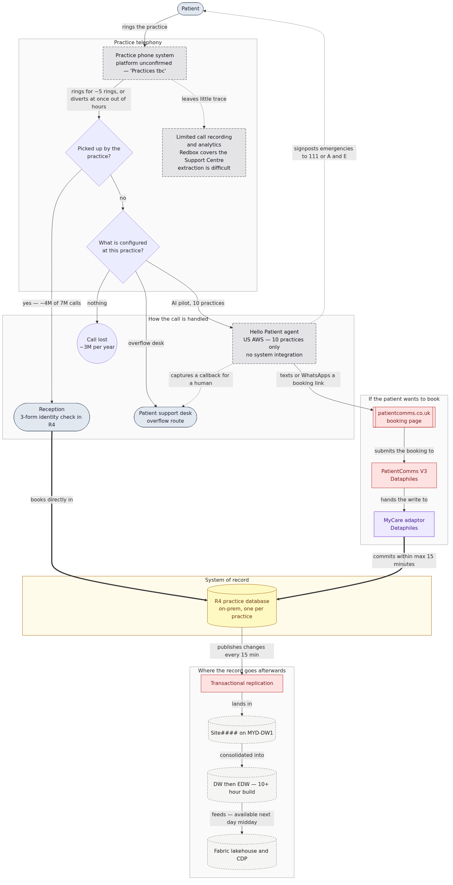
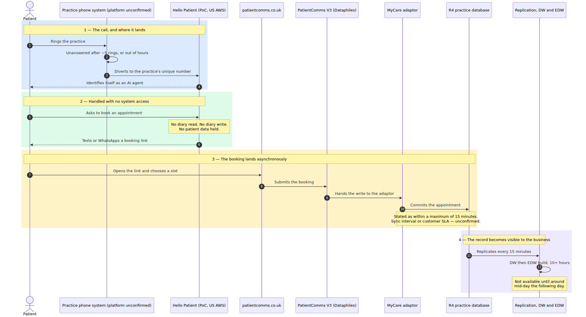

# What happens today when a patient calls

**The as-is call flow across mydentist's estate, with the evidence for every step.**

| | |
|---|---|
| Purpose | Establish the current journey before anything is proposed — the "before" picture |
| Scope | Inbound patient calls to practices. Support-centre helpdesk calls are noted where they differ |
| Status | **Reconstructed from client material. No system has been accessed and no call has been observed.** |
| Sourcing | Every step carries a tag. See §1. Three hops are genuinely unknown and are drawn as such — §6 |
| Companions | `docs/mydentist-current-state.md` (the systems) · `docs/Architecture.md` (**our proposal** — deliberately not drawn here) |

> **This document describes the current state only.** Per `docs/diagram-conventions.md`, current state and target state are kept on separate canvases so nothing here can be mistaken for something already built.

---

## 1. Sources

| Tag | Source | Date |
|---|---|---|
| `[BRIEF §n]` | `docs/client documentation/mydentist AI Delivery Partner Brief v1.2.docx`, §n | 2 Jul 2026 |
| `[CAD:n]` | `docs/client documentation/Architecture_Design_CRM_HubSpot_and_MYD.md`, line n | DRAFT v0.1, decisions to 25 Jun 2026 |
| `[CS §n]` | `docs/mydentist-r4-current-state.md`, §n — our transcription of the Dec 2024 data-warehouse diagram | source v1.0, Dec 2024 |
| `[OURS]` | **No external source.** Our inference | — |
| `[ABSENCE]` | Not present in any material we hold | — |

Verbatim quotes are in **Appendix A**, so every paraphrase can be checked against its source.

---

## 2. The flow

*What happens today when a patient rings a practice: four possible destinations, only one of which touches a system of record during the call. Dashed grey marks what is unconfirmed or not ours to reason about — including the practice phone platform itself. Source: `docs/diagrams/mermaid/as-is-call-flow.mmd`.*

| Colour | Means |
|---|---|
| Slate | People — reception, the support desk, the patient |
| Red | Systems we don't control |
| Violet | Third-party adaptor — the only component that writes to R4 |
| Amber | The authoritative store |
| Dashed stone | Derived, rebuildable stores |
| Dashed grey | Unconfirmed, or sealed behind a vendor contract |

---

## 3. Stage by stage

### Stage 1 — The call reaches the practice

| Step | What happens | Evidence |
|---|---|---|
| 1.1 | Patient rings their practice | `[BRIEF §4]` — ~7M calls a year into practices |
| 1.2 | The call rings at the practice phone system | **Platform unconfirmed.** Maintel, MiCollab, Ignite, Redbox and CCM are named for the **Support Centre**; practices are marked **"Practices tbc"** `[BRIEF §9]`. The CAD describes Mitel only in the Support Centre `[CAD:138-148]` |
| 1.3 | It rings for about five rings, or diverts immediately out of hours | `[BRIEF §8.1]` — "when a call goes unanswered after about five rings, or out of hours" |

**No IVR, menu or routing logic is described at practice level** `[ABSENCE]`. Whether one exists is unknown.

### Stage 2 — One of four things happens

| Outcome | Volume | What happens | Evidence |
|---|---|---|---|
| **Reception answers** | ~4M of 7M `[BRIEF §4]` | Handled by a human working directly in R4 on an in-practice PC. Identity is established by a **three-form check** under the documented Patient Services process | `[BRIEF §4]` `[BRIEF §10]`; R4 client is "a mixture of VB6 and .NET components" against a local SQL Server `[CAD:1231]` |
| **Diverts to the AI pilot** | **10 practices only** | Unique per-practice number → SIP trunk → Hello Patient, running in **US AWS** | `[BRIEF §8]` `[BRIEF §8.1]` |
| **Overflow desk** | Not quantified | An overflow route from practices to a patient support desk exists. It "is **not a full call centre**, and it does not close the gap" | `[BRIEF §4]` |
| **Nothing — the call is lost** | **~3M a year** | ~2M unanswered in working hours, ~1M out of hours "where we have no call handling capability" | `[BRIEF §4]` |

**What happens to a lost call is not described anywhere** `[ABSENCE]`. No voicemail, callback queue or abandoned-call handling appears in any source. The brief treats the 3M simply as missed — which, since closing that gap is the business case, is worth confirming rather than assuming `[OURS]`.

### Stage 3 — If the AI pilot takes the call

Everything here is from `[BRIEF §8.1]` and `[BRIEF §8.2]`.

| Step | What happens |
|---|---|
| 3.1 | The agent **identifies itself as an AI agent**, using an agreed preamble |
| 3.2 | General enquiries are answered from "a small, approved knowledge base loaded once, covering practice and basic dentistry information only" |
| 3.3 | **Appointment requests are handled by texting or WhatsApping a booking link. There is no diary write in the PoC** |
| 3.4 | Emergencies are **signposted to 111 or A&E** |
| 3.5 | Transfer back to the practice is attempted where possible; complex or unclear needs are captured for a human call-back |

**Three exclusions are deliberate** `[BRIEF §8.2]`: no integration to HubSpot, no appointment booking by API, and **no patient data uploaded to Hello Patient**. The brief states: "These three gaps are exactly what production must close."

The PoC "has been through our technical design authority" `[BRIEF §8.1]`, and Hello Patient "is not a done deal, it is primarily a learning exercise and to prove the technology & harvest data" `[BRIEF §8.2]`.

### Stage 4 — If the patient books

This is the only path by which a call indirectly reaches R4 today, and it is asynchronous.

*How a booking prompted by a call actually reaches R4: the agent never touches the diary — it hands the patient a link, and the write lands through Dataphiles up to fifteen minutes later. Source: `docs/diagrams/mermaid/as-is-booking-write.mmd`.*

| Step | What happens | Evidence |
|---|---|---|
| 4.1 | The patient opens the link and lands on a `patientcomms.co.uk` URL, "where the actual booking is taken" | `[CAD:116]` |
| 4.2 | PatientComms hands the write to the **MyCare adaptor**, which "has access to read and write R4 data" | `[CAD:114]` |
| 4.3 | The booking "is then sent on to R4, **within a maximum of 15 minutes**" | `[CAD:116]` |

Colleagues have the same capability through **Central Booking**, "a different UI sat upon PatientComms" `[CAD:116]`. PatientComms is used for R4 practices only — not Orthobridge or Dentally `[CAD:118]`.

**The 15-minute figure is load-bearing and unverified.** `[OURS]` It may be a sync interval or a customer-facing end-to-end SLA; the material does not say. Note that `[CS §3.3]` independently gives practice→subscriber *replication* as 15 minutes — a different direction and mechanism with the same number.

### Stage 5 — Where the record goes afterwards

| Hop | Latency | Evidence |
|---|---|---|
| R4 → `Site####` on MYD-DW1, via transactional replication through distributor BI-DISTSVR01 | ~15 minutes | `[CS §3.2]` `[CS §3.3]` |
| `Site####` → `DW` consolidation | Not stated `[ABSENCE]` | `[CS §3.3]` |
| `DW` → `EDW` | **10+ hours per build** | `[CS §3.3]` |
| End-to-end, to the business | **"not available until around mid-day the following day to the data it covers"** | `[CAD:617]` |
| EDW → Fabric lakehouse and CDP | Feeds the strategic platform | `[CAD:231]` `[CAD:362]` |

---

## 4. What this flow does not do

Each of these is an absence in the current state, not a criticism of it. `[OURS]`

| It does not… | Evidence |
|---|---|
| **Identify the caller before a human does.** There is no customer identity system — "We do not yet have customer identity via Entra External ID" `[BRIEF §12]`. The CDP that masters the unique customer identifier `[BRIEF §10]` sits in the analytics plane, inside Fabric `[CAD:362]`, not in the call path | `[BRIEF §10]` `[BRIEF §12]` |
| **Write to the diary during the call.** Reception writes directly; the AI pilot writes nothing; the online path lands up to 15 minutes later | `[BRIEF §8.1]` `[CAD:116]` |
| **Leave a CRM record.** There is no CRM in the practice-call path at all. Salesforce covers only outbound Lead Gen consults `[CAD:130-136]` and is retired in Phase 1 `[CAD:364]`. HubSpot goes live this month but for marketing and Lead Gen, with voice explicitly carved out as "another project" `[CAD:179]` | `[CAD:130-136]` `[CAD:179]` |
| **Capture why the patient called.** "We have limited call analytics and limited call recording, so we have poor visibility of why patients call and where we lose them" `[BRIEF §4]`. Redbox covers the Support Centre, and "getting data out of Redbox for analysis is difficult today" `[BRIEF §9]` | `[BRIEF §4]` `[BRIEF §9]` |
| **Reconcile the patient across practices.** R4 holds no single customer view — a patient who moves practice **must** get a new record, and duplicates also arise within a practice when an online booking does not match an existing record exactly | `[CAD:235]` |
| **Cover the whole estate.** R4 is ~98% of practices; Orthobridge serves orthodontics and Dentally care homes, and PatientComms serves neither | `[BRIEF Appendix C]` `[CAD:118]` |

---

## 5. The volumes, in one place

| Measure | Figure | Source |
|---|---|---|
| Calls into practices per year | ~7 million | `[BRIEF §4]` |
| Answered | ~4 million | `[BRIEF §4]` |
| Missed during working hours | ~2 million | `[BRIEF §4]` |
| Out of hours, no capability | ~1 million | `[BRIEF §4]` |
| **Total missed** | **~3 million** | `[BRIEF §4]` |
| Practices | ~530, R4 across ~98% | `[BRIEF §9]` `[BRIEF Appendix C]` |
| Practices covered by the AI pilot | **10** | `[BRIEF §8]` |
| Typical support-centre call | ~7 minutes | `[BRIEF §4]` |

**Why the calls come in** is catalogued in `[BRIEF Appendix A]` across five groups — access and existing-patient enquiries, new enquiries, advice and guidance, scenario-specific, and feedback and non-patient. The client's stated priority order for automation is cancellations, reschedules, recalls, new patient enquiries, then advice and guidance `[BRIEF §6.3]`.

---

## 6. The three hops we cannot describe

Per `docs/diagram-conventions.md`, "an unresolved question is a diagram element, not a footnote" — each of these is drawn as a dashed node rather than hidden inside a confident box.

| # | Unknown | Why it matters |
|---|---|---|
| **U1** | **The practice telephony platform.** The brief marks it "Practices tbc" `[BRIEF §9]` and notes discussions with the telco provider have only just started | It is the first hop of every call, and it determines how a voice agent would be inserted at all `[OURS]` |
| **U2** | **Whether any IVR or routing logic runs before the divert** `[ABSENCE]` | Changes what the agent receives and what context travels with the call `[OURS]` |
| **U3** | **What happens to a missed call** `[ABSENCE]` — no voicemail, queue or abandoned-call handling is described for the ~3M | This is the volume the business case rests on `[BRIEF §4]` `[OURS]` |

Two further uncertainties sit inside steps that *are* described:

- **Is `[CAD:116]`'s 15 minutes a sync interval or a customer SLA?** `[OURS]` It determines whether R4 can be stale with respect to confirmed bookings — carried in full in `discovery/Integrations/r4-integration-feasibility.md` §6.
- **How much of the ~3M reaches the overflow desk**, versus being lost outright. The brief quantifies neither `[ABSENCE]`.

---

## Appendix A — Verbatim quotes

**A.1 — Call volumes.** `[BRIEF §4]`:

> We receive around 7 million calls into practices each year. We answer about 4 million. Roughly 1 million come in out of hours, where we have no call handling capability, and about 2 million go unanswered during working hours.

> We have limited call analytics and limited call recording, so we have poor visibility of why patients call and where we lose them.

> We run an overflow route from practices to a patient support desk today. It is not a full call centre, and it does not close the gap.

**A.2 — How the PoC handles a call.** `[BRIEF §8.1]`:

> Call routing: the PBX diverts to a unique Hello Patient number per practice when a call goes unanswered after about five rings, or out of hours. The unique number identifies the practice.

> Connectivity: calls reach Hello Patient over a SIP trunk, and Hello Patient runs in AWS.

> Transparency: the agent always identifies itself as an AI agent, using an agreed preamble.

> Appointments: appointment requests are handled by texting or WhatsApping a booking link. There is no diary write in the PoC.

> Knowledge: general enquiries are answered from a small, approved knowledge base loaded once, covering practice and basic dentistry information only.

> Handling: transfer back to the practice is attempted where possible, emergencies are signposted to 111 or A&E, and complex or unclear needs are captured for a human call-back.

**A.3 — What the PoC leaves out.** `[BRIEF §8.2]`:

> No integration to HubSpot.
> No appointment booking by API.
> No patient data uploaded to Hello Patient.

> These three gaps are exactly what production must close.

**A.4 — Practice telephony is unconfirmed.** `[BRIEF §9]`, Telephony row:

> Maintel platform, MiCollab dialling, Ignite inbound, Redbox recording, CCM reporting for Support Centre.  Practices tbc

> Getting data out of Redbox for analysis is difficult today.

**A.5 — The booking path into R4.** `[CAD:116]`:

> It also manages online bookings by customers and colleagues. Online bookings take the patient to a patientcomms.co.uk URL where the actual booking is taken and this is then sent on to R4, within a maximum of 15 minutes. Similar functionality is available to colleagues to book appointments for patients via the Central Booking tool, which is a different UI sat upon PatientComms.

**A.6 — The write mechanism.** `[CAD:114]`:

> It has access to read and write R4 data through the MyCare adaptor which it uses to send comms out to patients via SMS / email to remind them of appointments or to book a Recall.

**A.7 — The human identity benchmark.** `[BRIEF §10]`:

> The Patient Services process is well documented. It shows the exact steps a human agent follows in R4 for searching patients, three-form identity checks, booking and amending appointments, changing details, and taking card-not-present payments through a secure service. Any automation must match this control level or improve on it.

**A.8 — Next-day data latency.** `[CAD:617]`:

> The limiting factor for the earliest build time will be the R4 data which has to come through the EDW and is currently not available until around mid-day the following day to the data it covers.

**A.9 — No single customer view in R4.** `[CAD:235]`:

> We do not even have a single customer view _within_ some of our systems. Notably, R4, where the data is contained in a SQL Server instance in each practice. Therefore if a patient moves house and moves practice they MUST create another record in the SQL Server instance in the new practice.

**A.10 — Voice is out of CRM scope.** `[CAD:179]`, Out Of Scope:

> Voice AI for incoming calls. Although HubSpot has some capability in this area we are looking at this capability as part of another project.
