# mydentist – Current On-Premise Data Warehouse

**Discovery notes: legacy architecture as described in client-supplied material**

| | |
|---|---|
| Client | mydentist (UK dental group, ~530 practices) |
| Source material | `0__On_Premise.png` – "Current On-Premise Data Warehouse Architecture", v1.0, December 2024 |
| Client's stated purpose | Current state only: existing architecture, naming and flow. "Not a proposed future design." |
| Status | Transcription and analysis of client material. Nothing here has been validated against running systems. |
| Convention | **Stated** = shown in the client diagram. **Inferred** = our reading, to be confirmed. |
| What this is | A transcription of **one** client diagram. It describes the reporting and analytics chain only. For the estate as a whole see `docs/mydentist-current-state.md` |

---

## 1. Summary

mydentist runs around **530 dental practices**, R4 covering about 98% of them, with **two SQL Server databases per practice** (`R4_Main`, `R4_Reporting`) on individual on-prem practice servers. The source diagram covers the R4 estate only — **Orthobridge** (orthodontics) and **Dentally** (care-home settings) are separate practice management systems and do not appear in this chain. See `docs/mydentist-current-state.md` §3.

Data flows through **SQL Server transactional replication** (distributor **BI-DISTSVR01**) into a per-practice **`Site####`** database on **MYD-DW1** every **15 minutes**. It is then cleaned and consolidated in the **`DW`** database and moved by the **IDH-SITEREPL** process into the **`EDW`** enterprise warehouse. EDW feeds SSRS, Power BI, extracts, SFTP feeds, APIs and legacy/ad-hoc consumers.

A full DW → EDW build takes **10+ hours**, and some downstream dependencies are **not fully documented**.

This setup covers the **entire estate** today.

**Scope note:** this is the client's reporting and analytics chain. It is recorded here because it is the only written description of the R4 estate we hold — the practice topology, the database names and the per-practice structure all come from it. It is **not** a path our architecture uses. Voice integration needs a transactional interface to R4, which no part of this chain provides. See `discovery/Integrations/r4-integration-feasibility.md`.

---

## 2. Naming and Glossary

| Name | What it is |
|---|---|
| **R4** | Practice management system used across the estate |
| **`R4_Main` / `R4_Reporting`** | The two R4 databases on each practice server |
| **Practice ####** | Practice identifier, 4-digit (`0001`–`0999` shown) |
| **Practice servers** | On-prem SQL Servers at each practice; replication **publishers** |
| **BI-DISTSVR01** | Replication **distributor** |
| **MYD-DW1** | Replication **subscriber** server, hosting `DW` and the `Site####` databases |
| **`Site####`** | A practice's replicated database on MYD-DW1 (`Site0001` … `Site0999`) |
| **DW** | Consolidated database on MYD-DW1 |
| **IDH-SITEREPL** | Server hosting `EDW`. Also the name of the DW → EDW process. |
| **EDW** | Enterprise data warehouse: modelling and transformation |

---

## 3. Architecture

### 3.1 Flow

```mermaid
flowchart LR
    subgraph EST["R4 Practice Estate (500+ practices, on-prem)"]
        direction TB
        P1["Practice 0001<br/>R4_Main + R4_Reporting"]
        P2["Practice 0002<br/>R4_Main + R4_Reporting"]
        PN["... Practice 0999<br/>R4_Main + R4_Reporting"]
    end

    subgraph REP["SQL Server Transactional Replication"]
        direction TB
        PUB["Practice servers<br/>(Publishers)<br/>Log Reader Agents"]
        DIST["BI-DISTSVR01<br/>(Distributor)<br/>Distribution Agents"]
        PUB --> DIST
    end

    subgraph DW1["MYD-DW1"]
        direction TB
        SITES["Site0001 ... Site0999<br/>(one DB per practice)"]
        DWDB["DW database<br/>clean, standardise,<br/>consolidate"]
        SITES --> DWDB
    end

    subgraph EDWS["IDH-SITEREPL"]
        EDW["EDW database<br/>modelling and transformation"]
    end

    subgraph CONS["Consumers"]
        direction TB
        C1["SSRS reports"]
        C2["Power BI reports"]
        C3["Data extracts (CSV/Excel)"]
        C4["SFTP feeds (int/ext)"]
        C5["APIs (int/ext)"]
        C6["Legacy systems, ad-hoc"]
    end

    EST --> PUB
    DIST -- "every 15 min" --> SITES
    DWDB -- "IDH-SITEREPL process<br/>10+ hours per build" --> EDW
    EDW --> CONS
```

### 3.2 Component detail

| Layer | Component | Stated detail |
|---|---|---|
| Source | R4 practice estate | 500+ practices; two R4 DBs per practice (`R4_Main`, `R4_Reporting`); on individual on-prem practice servers |
| Replication | Practice servers (publishers) | Transactional replication, Log Reader Agents, Distribution Agents, "existing operational processes" |
| Replication | BI-DISTSVR01 | Distributor; distributes replicated data to the subscriber |
| Subscriber | MYD-DW1 / `Site####` | Each practice replicated into its own Site database **every 15 minutes** |
| Consolidation | MYD-DW1 / `DW` | Cleans and standardises Site data; combines all Sites into a consolidated structure within DW |
| Warehouse | IDH-SITEREPL / `EDW` | Receives DW data via the IDH-SITEREPL process; modelling and transformation; supports reporting and downstream consumers |
| Consumers | Various | SSRS, Power BI, CSV/Excel extracts, SFTP feeds (external/internal), APIs (internal/external), legacy systems and ad-hoc |

### 3.3 Latency profile (stated and inferred)

| Hop | Latency |
|---|---|
| Practice → `Site####` | ~15 minutes (stated) |
| `Site####` → `DW` consolidation | Not stated |
| `DW` → `EDW` | 10+ hours per warehouse build (stated) |
| End-to-end freshness for consumers | Likely bounded by the EDW build, i.e. effectively daily or worse (inferred) |

---

## 4. Ownership

- The client team owns "the source/DBA/replication/ingestion/operations side" — the data-platform estate.
- "Some dependencies pre-date our team and are not fully documented."
- Ownership of the DW consolidation logic, the EDW model and each consumer is not stated.
- **Nobody in this material owns R4 itself.** Every team named here is downstream of R4, reading from it. The owners of R4 operations, and of any interface into it, are not identified — which is why the write-path question has to be taken to Carestream and Dataphiles rather than to this team.

---

## 5. Client's Discovery Scope

The client listed these as in scope for the current-state discussion:

- R4 estate and databases
- Replication architecture
- MYD-DW1 (DW) and `Site####` databases
- IDH-SITEREPL and EDW (high level)
- Existing consumers and dependencies
- Operational considerations

---

## 6. Observations

1. **Two databases per practice, one Site DB.** Each practice has `R4_Main` and `R4_Reporting`, but MYD-DW1 shows a single `Site####` per practice. Either only one is replicated, or both are merged into one subscriber DB.
2. **Numbering vs count.** IDs run `0001`–`0999` against an estate of ~530, so the ID space is sparse (closures, mergers, reserved ranges). There's no stated master list of active practices.
3. **IDH-SITEREPL is overloaded.** It's both a server name and the name of the DW → EDW process. The process technology (SSIS, Agent jobs, stored procedures, replication again?) isn't shown.
4. **Heavy replication footprint.** ~530 publishers through a single distributor (BI-DISTSVR01) to a single subscriber. Distributor sizing, agent counts and failure handling are not described.
5. **The 10+ hour build** is the main stated pain point. It's not clear whether it's a full rebuild every time, how often it runs, or what it blocks while running.
6. **Undocumented consumers.** SFTP feeds, external APIs and legacy systems imply contractual or external obligations that will constrain any migration or decommissioning.
7. **Every arrow in this diagram points away from R4.** Nothing here writes to R4, reads it synchronously, or describes an interface to it. This is a reporting diagram, and a reporting diagram has no reason to depict a transactional interface even where one exists — its silence on the subject carries no weight either way.

   R4 does have a read/write interface. PatientComms "has access to read and write R4 data through the MyCare adaptor" (CRM CAD, line 114), and MyCare is named in the client's RFP brief as a connector already running in the estate (AI Delivery Partner Brief §9, §10). It is simply out of scope for this chain. See `discovery/Integrations/r4-integration-feasibility.md`.

---

## 7. Open Questions for the Client

### Source and replication
- Which R4 databases are replicated: `R4_Main`, `R4_Reporting`, or both? How do they map to `Site####`?
- What is the distributor's configuration (push or pull subscriptions, agent schedules, retention), and how often does replication break or need reinitialising?
- Where is the master list of active practices, and how are openings, closures and mergers handled?
- How often are R4 version upgrades applied, and what do they do to replication?

### DW and EDW
- What technology runs DW consolidation and the IDH-SITEREPL process?
- Does each EDW build reload everything? How often does it run, and what's affected while it runs?
- What does the EDW model look like (star schema, number of facts/dimensions), and is it documented?
- What are the server specs, SQL Server versions and licensing for MYD-DW1, IDH-SITEREPL and BI-DISTSVR01?

### Consumers
- Can they provide an inventory of SSRS reports, Power BI reports, extracts, SFTP feeds and APIs, with owners and usage?
- Which feeds are external or contractual, and what SLAs apply?
- Which consumers rely on EDW specifically vs DW or the Site databases directly?

### R4 itself — the questions that matter for voice
These sit outside the client's own current-state scope, which is why they are not answered anywhere above. They are carried in full in `discovery/Integrations/r4-integration-feasibility.md`.

- Who owns R4 operations, and who authorises a programmatic write to a practice?
- What does the MyCare Adaptor expose, where does it run, at what latency, and can mydentist invoke its write direction? (It exists, runs in the estate, and reads and writes R4 — CAD:114, BRIEF §9-10.)
- How does Dataphiles online booking write into R4 today, and how does it derive availability?
- Is there a non-production R4 practice instance we can test against?

---

## 8. Risks (for discussion)

| # | Risk | Likelihood | Impact | Notes |
|---|---|---|---|---|
| L1 | Undocumented consumers missed during migration | Medium | High | Stated explicitly by the client |
| L2 | Single distributor / subscriber is a single point of failure for estate reporting | Medium | High | No HA/DR shown |
| L3 | 10+ hour build leaves little room for re-runs after a failure | High | Medium | Recovery time likely spills into business hours |
| L4 | Legacy knowledge concentrated in few people | Unknown | High | Implied by "pre-date our team" |
